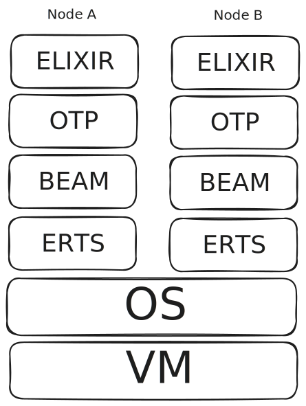
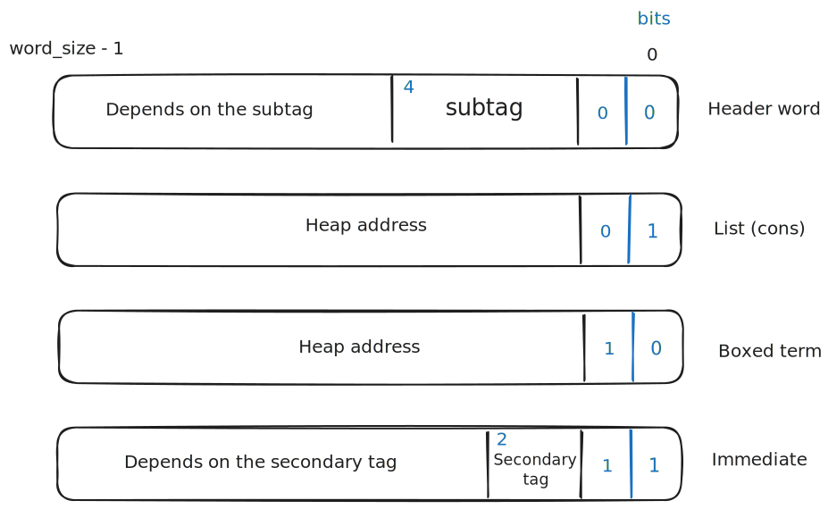
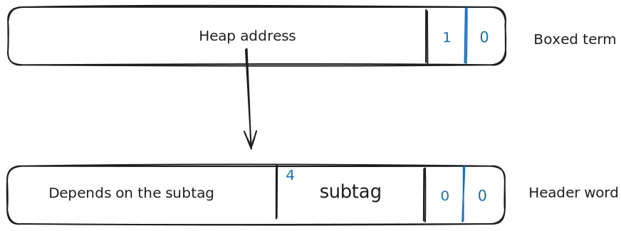
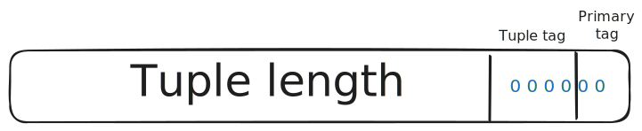

# Los Tipos de Erlang y Elixir

<div style="font-size: 36px;">

```elixir
def speaker do
  %{
    name: "Víctor Fernández",
    city: "Madrid",
    company: "Doofinder",
    github: "github.com/victor23k"
  }
end
```

</div>

<!--

Los tipos reales, no los nuevos tipos.
Tipo suena a dude en un doblaje al español de película americana.

-->

---

# Qué es un sistema de tipos?

- Un tipo es una propiedad asociada a un término (term).
- Sistema de tipos `!=` Comprobación de tipos.
- Todos los lenguajes tienen sistema de tipos.

<!--

Un sistema de tipos define los tipos disponibles y los asocia a los términos.

-->

---

# Comprobación de tipos

- Estática `=>` tiempo de compilación.
- Dinámica `=>` tiempo de ejecución.
- Gradual `=>` ambos. (`Elixir` 👀)

---

# Generación de valores

<div class="columns">
<div>

## Literales

- `["Hello", 9_000, {:ok, :completed}]`

</div>
<div>

## Efectos secundarios

- `File.read/1`
- `:gen_tcp.recv/2`

</div>
</div>

<!--

Cómo se generan valores para que el sistema de tipos pueda determinar su tipo?

-->

---

# ¿Cómo representamos el valor?

<div class="columns">
<div>

### ChatGPT one-shot

```c
typedef enum {
    TYPE_INT,
    TYPE_FLOAT,
    TYPE_STRING,
    TYPE_BOOL,
    // add more as needed
} ValueType;

typedef struct {
    ValueType type;
    union {
        int int_val;
        float float_val;
        char *string_val;
        int bool_val; // use int for bool in C
    } as;
} Value;
```

</div>
<div>

### Erlang devs

```c
typedef unsigned long Eterm;
```

</div>
</div>

---

# ¿Cómo representamos el valor?

<div class="columns">
<div>

### ChatGPT one-shot

```c
typedef enum {
    TYPE_INT,
    TYPE_FLOAT,
    TYPE_STRING,
    TYPE_BOOL,
    // add more as needed
} ValueType;

typedef struct {
    ValueType type;
    union {
        int int_val;
        float float_val;
        char *string_val;
        int bool_val; // use int for bool in C
    } as;
} Value;
```

</div>
<div>

### Erlang devs

```c
typedef unsigned long Eterm;
```

<div style="padding-left:150px; padding-top:50px;">


</div>

</div>
</div>

---

# BEAM y ERTS

<div style="text-align: center;">



</div>

---


# Tags y la tag primaria

<div style="text-align: center;">



</div>

---

# Inmediatos

- Terms auto contenidos en una sola palabra.

<div class="columns">
<div>

### Tag primaria de inmediato

- `00`: pid
- `01`: port
- `10`: inmediato dos
- `11`: small integer

</div>
<div>

### Tag secundaria de inmediato

- `00`: atom
- `01`: catch
- `10`: sin usar
- `11`: `[]` (NIL)

</div>
</div>

---

# Átomos

- Cadenas de texto compartidas en hash table.
- Parecido a string interning.
- `index` + `tag`
- Comparaciones muy rápidas, solo se compara el índice.

---

# Listas

## Cons - tag `01`

Dos palabras consecutivas en la heap:

- head
- tail

---

# Listas "proper"

Tail contiene un puntero a otra `cons` o `[]`. 

```elixir
iex(1)> [:a | [:b | []]]
[:a, :b]
```

# Listas "improper"

La tail realmente puede ser cualquier term, lo que constituiría una "improper list".

```elixir
iex(2)> [:a | :b]
[:a | :b ]
```

---

# IO Lists

```erlang
-type iolist() :: maybe_improper_list(byte() | binary() | iolist(), binary() | []).
```

## Ejemplo de IO list

```elixir
iex(3)> :re.replace("Hello & Goodbye", "&", "&amp;")
["Hello ", ["&", "amp;"] | " Goodbye"]
```

<!-- ref: https://www.evanmiller.org/elixir-ram-and-the-template-of-doom.html -->

## Simplemente alquimia

```elixir
iex(5)> iolist = ~w(a b c d e) |> Enum.reduce([], fn item, acc -> [acc | item] end)
[[[[[[] | "a"] | "b"] | "c"] | "d"] | "e"]
iex(6)> IO.iodata_to_binary(iolist)
"abcde"
```

---

# IO lists

- Se puede añadir un elemento en tiempo constante.
- `Phoenix`: motor de plantillas `HEEx`.
- Optimizadas para operaciones de entrada y salida.

---

# `writev`, `readv` y `iovec`

- The `readv()` system call reads `iovcnt` buffers from the file associated with the file descriptor `fd` into the buffers described by `iov` ("scatter input").

- The `writev()` system call writes `iovcnt` buffers of data described by `iov` to the file associated with the file descriptor `fd` ("gather output"). 


```c
struct iovec {
    void  *iov_base;    /* Starting address */
    size_t iov_len;     /* Number of bytes to transfer */
};
```

---

# Boxed terms

<div class="columns">

<div style="width:800px;">



</div>

<div style="padding-left:250px;">

- Tuplas
- Refs
- Funciones
- Binarios
- Mapas

</div>
</div>

---

# Tuplas

- Array de terms
- Memoria contigua 
- Longitud máxima: `16_777_215`

  > Elements in a tuple - The maximum number of elements in a tuple is 16,777,215 (24-bit unsigned integer).

<div style="text-align:center; margin-top:50px;">



</div>

---

# Bitstrings y binarios

- Array inmutable de bytes
- Los binarios son bitstrings con tamaño divisible por 8.
- En Elixir las strings están implementadas como binarios.

## Tipos de bitstrings

- heap bitstring: `1000`
- sub bitstring: `1001`
- binary ref: `1010`

---

# Heap bitstring

- Se guarda en la memoria heap del proceso.
- Menor de 64 bytes.
- Para mandar a otro proceso, hay que copiar.

---

# Sub bitstring

- Vista a una parte de un bitstring.
- Se usa para hacer pattern matching.

---

# Binary ref

- Para binarios grandes - `> 64 bytes`.
- Se guardan en una memoria heap global para todos los procesos.
- Para mandar a otro proceso solo se copia la referencia.
- Recolector de basura.

---

# BIFs de comprobación de tipos

- `is_atom/1`
- `is_binary/1`

## Comprobación de tipos en tiempo de ejecución

- Simplemente con mirar el tag sabemos su tipo.
- Built-in functions

---

# Pattern matching

Al hacer pattern matching, lo primero que se comprueba es el tipo de la variable.

---

# Pattern matching: listas

## Elixir

```elixir
def match([head | tail]), do: :list
```

## BEAM

```elixir
{:test, :is_nonempty_list, {:f, 10}, [x: 0]}
```

---

# `is_nonempty_list`

```cpp
a.test(list_ptr, imm(_TAG_PRIMARY_MASK - TAG_PRIMARY_LIST));
```

> The x86 TEST instruction:
>
> Performs a bitwise AND operation between two operands
> Sets CPU flags based on the result (particularly the Zero Flag)

---

# Pattern matching: tuplas

## Elixir

```elixir
def match({first, second}), do: :tuple
```

## BEAM

```elixir
{:test, :is_tuple, {:f, 10}, [{:x, 0}, 2]},
```

---

# Conclusiones

<div style="font-size:40px">

- Erlang -> 🚬CINE
- 🇸🇪 -> 📉🌅 -> 📈💻

</div>

<!--

Todo el ecosistema de Erlang y la OTP es brutal. Llevan casi 40 años haciendo esto y entrar en las tripas te hace
comprender lo complicado que es construir algo así.

Suecia puede ser top 5 en desarrolladores sin ningún problema. Al menos en lo importante, fútbol, llevan 70 años sin
jugar un partido relevante. 

A mí personalmente me ayuda intentar comprender las herramientas que uso: me da confianza a usarlas. 

-->

---

# Preguntas

---

# Gracias
